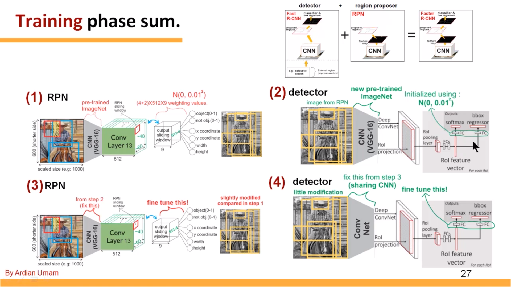

# A Pytorch Implementation of Faster R-CNN

## Introduction
This project is a pytorch implementation of faster R-CNN froked from *[wyang/faster-rcnn.pytorch](https://github.com/jwyang/faster-rcnn.pytorch)

### What I am doing and going to do
- [x] 4-step alternating training(based on the paper and kind instruction from https://www.youtube.com/watch?v=cSO1nUj495Y&index=5&list=PLkRkKTC6HZMzp28TxR_fJYZ-K8Yu3EQw0)
- [x] Flow of Tensor which is just same as my code.
- [ ] Support pytorch-0.4.1 or higher.
<<<<<<< HEAD
- [ ] Flow of Tensor which is just same as my code.
=======
>>>>>>> 718f7c042cea36665dcdd360a009171d77938f10
- [ ] RFCN.
- [ ] CoupleNet.

## Other Implementations

* [Feature Pyramid Network (FPN)](https://github.com/jwyang/fpn.pytorch)

* [Mask R-CNN](https://github.com/roytseng-tw/mask-rcnn.pytorch) (~~ongoing~~ already implemented by [roytseng-tw](https://github.com/roytseng-tw))

* [Graph R-CNN](https://github.com/jwyang/graph-rcnn.pytorch) (extension to scene graph generation)

## Tutorial

* [Blog](http://www.telesens.co/2018/03/11/object-detection-and-classification-using-r-cnns/) by [ankur6ue](https://github.com/ankur6ue)

## Preparation


First of all, clone the code
```
git clone https://github.com/Arieszhang1994/faster-rcnn_pytorch.git
```

Then, create a folder:
```
cd faster-rcnn.pytorch && mkdir data
```

### prerequisites

* Python 2.7 or 3.6
* Pytorch 0.4.0 (**now it does not support 0.4.1 or higher**)
* CUDA 8.0 or higher

### Data Preparation

* **PASCAL_VOC 07+12**: Please follow the instructions in [py-faster-rcnn](https://github.com/rbgirshick/py-faster-rcnn#beyond-the-demo-installation-for-training-and-testing-models) to prepare VOC datasets. Actually, you can refer to any others. After downloading the data, creat softlinks in the folder data/.

* **COCO**: Please also follow the instructions in [py-faster-rcnn](https://github.com/rbgirshick/py-faster-rcnn#beyond-the-demo-installation-for-training-and-testing-models) to prepare the data.

* **Visual Genome**: Please follow the instructions in [bottom-up-attention](https://github.com/peteanderson80/bottom-up-attention) to prepare Visual Genome dataset. You need to download the images and object annotation files first, and then perform proprecessing to obtain the vocabulary and cleansed annotations based on the scripts provided in this repository.

### Pretrained Model

We used two pretrained models in our experiments, VGG and ResNet101. You can download these two models from:

* VGG16: [Dropbox](https://www.dropbox.com/s/s3brpk0bdq60nyb/vgg16_caffe.pth?dl=0), [VT Server](https://filebox.ece.vt.edu/~jw2yang/faster-rcnn/pretrained-base-models/vgg16_caffe.pth)

* ResNet101: [Dropbox](https://www.dropbox.com/s/iev3tkbz5wyyuz9/resnet101_caffe.pth?dl=0), [VT Server](https://filebox.ece.vt.edu/~jw2yang/faster-rcnn/pretrained-base-models/resnet101_caffe.pth)

Download them and put them into the data/pretrained_model/.

**NOTE**. We compare the pretrained models from Pytorch and Caffe, and surprisingly find Caffe pretrained models have slightly better performance than Pytorch pretrained. We would suggest to use Caffe pretrained models from the above link to reproduce our results.

**If you want to use pytorch pre-trained models, please remember to transpose images from BGR to RGB, and also use the same data transformer (minus mean and normalize) as used in pretrained model.**

### Compilation

As pointed out by [ruotianluo/pytorch-faster-rcnn](https://github.com/ruotianluo/pytorch-faster-rcnn), choose the right `-arch` in `make.sh` file, to compile the cuda code:

  | GPU model  | Architecture |
  | ------------- | ------------- |
  | TitanX (Maxwell/Pascal) | sm_52 |
  | GTX 960M | sm_50 |
  | GTX 1080 (Ti) | sm_61 |
  | Grid K520 (AWS g2.2xlarge) | sm_30 |
  | Tesla K80 (AWS p2.xlarge) | sm_37 |

More details about setting the architecture can be found [here](https://developer.nvidia.com/cuda-gpus) or [here](http://arnon.dk/matching-sm-architectures-arch-and-gencode-for-various-nvidia-cards/)

Install all the python dependencies using pip:
```
pip install -r requirements.txt
```

Compile the cuda dependencies using following simple commands:

```
cd lib
sh make.sh
```

It will compile all the modules you need, including NMS, ROI_Pooing, ROI_Align and ROI_Crop. The default version is compiled with Python 2.7, please compile by yourself if you are using a different python version.

**As pointed out in this [issue](https://github.com/jwyang/faster-rcnn.pytorch/issues/16), if you encounter some error during the compilation, you might miss to export the CUDA paths to your environment.**

## Train

Before training, set the right directory to save and load the trained models. Change the arguments "save_dir" and "load_dir" in trainval_net.py and test_net.py to adapt to your environment.

To train a faster R-CNN model with vgg16 on pascal_voc, simply run:
```
CUDA_VISIBLE_DEVICES=$GPU_ID python trainval_net.py \
                   --dataset pascal_voc --net vgg16 \
                   --bs $BATCH_SIZE --nw $WORKER_NUMBER \
                   --lr $LEARNING_RATE --lr_decay_step $DECAY_STEP \
                   --cuda
```
where 'bs' is the batch size with default 1. Alternatively, to train with resnet101 on pascal_voc, simple run:
```
 CUDA_VISIBLE_DEVICES=$GPU_ID python trainval_net.py \
                    --dataset pascal_voc --net res101 \
                    --bs $BATCH_SIZE --nw $WORKER_NUMBER \
                    --lr $LEARNING_RATE --lr_decay_step $DECAY_STEP \
                    --cuda
```
Above, BATCH_SIZE and WORKER_NUMBER can be set adaptively according to your GPU memory size. **On Titan Xp with 12G memory, it can be up to 4**.

If you have multiple (say 8) Titan Xp GPUs, then just use them all! Try:
```
python trainval_net.py --dataset pascal_voc --net vgg16 \
                       --bs 24 --nw 8 \
                       --lr $LEARNING_RATE --lr_decay_step $DECAY_STEP \
                       --cuda --mGPUs

```

Change dataset to "coco" or 'vg' if you want to train on COCO or Visual Genome.

## Test

If you want to evlauate the detection performance of a pre-trained vgg16 model on pascal_voc test set, simply run
```
python test_net.py --dataset pascal_voc --net vgg16 \
                   --checksession $SESSION --checkepoch $EPOCH --checkpoint $CHECKPOINT \
                   --cuda
```
Specify the specific model session, chechepoch and checkpoint, e.g., SESSION=1, EPOCH=6, CHECKPOINT=416.

## Test result
Mean AP for one step training from [wyang/faster-rcnn.pytorch](https://github.com/jwyang/faster-rcnn.pytorch)
```
python3 trainval_net.py --dataset pascal_voc --net res101 --nw 8 --bs 2 --epochs 20 --cuda
```
is 0.7478

Mean AP for 4 step training 
```
python3 trainval_net_alt.py --dataset pascal_voc --net res101 --nw 8 --bs 2 --epochs 20 20 20 20 --cuda
```
is 0.7245

I didn't fine tune the model right now and just choose the 20th epoch from each step.
Maybe the performance will be better if you select the "best" model in each step.

## Demo

If you want to run detection on your own images with a pre-trained model, download the pretrained model listed in above tables or train your own models at first, then add images to folder $ROOT/images, and then run
```
python demo.py --net vgg16 \
               --checksession $SESSION --checkepoch $EPOCH --checkpoint $CHECKPOINT \
               --cuda --load_dir path/to/model/directoy
```

Then you will find the detection results in folder $ROOT/images.

**Note the default demo.py merely support pascal_voc categories. You need to change the [line](https://github.com/jwyang/faster-rcnn.pytorch/blob/530f3fdccaa60d05fa068bc2148695211586bd88/demo.py#L156) to adapt your own model.**

## Webcam Demo

You can use a webcam in a real-time demo by running
```
python demo.py --net vgg16 \
               --checksession $SESSION --checkepoch $EPOCH --checkpoint $CHECKPOINT \
               --cuda --load_dir path/to/model/directoy \
               --webcam $WEBCAM_ID
```
The demo is stopped by clicking the image window and then pressing the 'q' key.

## For understanding Faster rcnn
I have view the whole code again to draw a flow chart of Tensor.
If you want to understand how the code runs fully, I recommend you watch this flow chart and the code at the same time,
which may help you to understand.

<div style="color:#0000FF" align="center">
 
</div>

Here is the screen shot of the video from https://www.youtube.com/watch?v=cSO1nUj495Y&index=5&list=PLkRkKTC6HZMzp28TxR_fJYZ-K8Yu3EQw0
<div style="color:#0000FF" align="center">
 
</div>

## Authorship

This project is contributed by [Aries Zhang](https://github.com/Arieszhang1994) and many others.

## Citation
    @article{ariesfaster2rcnn,
        Author = {Aries Zhang},
        Title = {A Pytorch Implementation of Faster R-CNN with 4-step training},
        Journal = {https://github.com/Arieszhang1994/faster-rcnn_pytorch.git},
        Year = {2018}
    }
    
    @article{jjfaster2rcnn,
        Author = {Jianwei Yang and Jiasen Lu and Dhruv Batra and Devi Parikh},
        Title = {A Faster Pytorch Implementation of Faster R-CNN},
        Journal = {https://github.com/jwyang/faster-rcnn.pytorch},
        Year = {2017}
    }

    @inproceedings{renNIPS15fasterrcnn,
        Author = {Shaoqing Ren and Kaiming He and Ross Girshick and Jian Sun},
        Title = {Faster {R-CNN}: Towards Real-Time Object Detection
                 with Region Proposal Networks},
        Booktitle = {Advances in Neural Information Processing Systems ({NIPS})},
        Year = {2015}
    }
